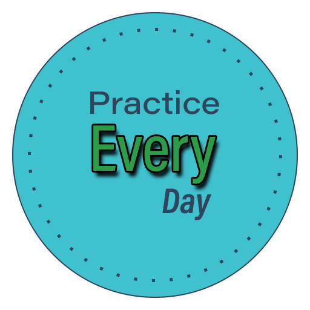
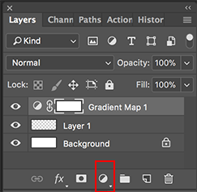
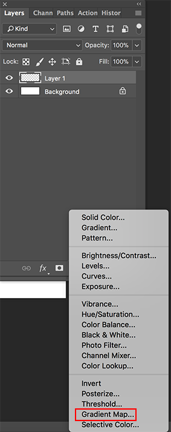

# Design Inspiration 2018

Mini Projects for Learning Design

I'm following this 365 day creativiy blog from [Yes I'm a Designer](http://www.yesimadesigner.com/365-days-of-creativity-daily-inspiration/) to help me learn design and the tools.

His [Patreon page](https://www.patreon.com/yesimadesigner) is better organized.

I will also use other resources to help me learn.

I'm also planning on writing about my learnings on my [blog](http://h4labs.org/category/design/).

## Other Resources
- [Udemy: Illustrator CC 2018 MasterClass](https://www.udemy.com/illustrator-cc-masterclass/learn/v4/overview)
---
## Day 16 - Design Challenge 2018: Procreate Drawing Tutorial

- [1 Minute Video](https://youtu.be/S-2CRhq_yTE)

### Notes

### Resources

[Dribbble Gradients]()

### Example

---
## Day 15 - Design Challenge 2018: Illustrator Geometric Illustration

- [1 Minute Video](https://youtu.be/NZM4Isx-dtI)

### Notes

### Resources

[Dribbble Gradients]()

### Example

---
## Day 14 - Design Challenge 2018: InDesign Image in Multiple Frames

- [1 Minute Video](https://youtu.be/ldufM3WnS7c)

### Notes

### Resources

[Dribbble Gradients]()

### Example

---

## Day 13 - Design Challenge 2018: Photoshop Seamless Pattern

- [1 Minute Video](https://youtu.be/CPaip5Ob3Ns)

### Notes

### Resources

[Dribbble Gradients]()

### Example

---

## Day 12 - Design Challenge 2018: InDesign Text Wrap

- [1 Minute Video](https://youtu.be/0rjIMDHiqR4)

### Notes

### Resources

[Dribbble Gradients]()

### Example

---

## Day 11 - Design Challenge 2018: Photoshop Neon Lights

- [1 Minute Video](https://youtu.be/LDEW2xcslaw)

<iframe width="560" height="315" src="https://www.youtube.com/embed/LDEW2xcslaw" frameborder="0" allow="autoplay; encrypted-media" allowfullscreen></iframe>

### Notes

### Resources

[Dribbble Gradients]()

### Example

---
## Day 10 - Design Challenge 2018: Flower Wreath in Illustrator

- [1 Minute Video](https://youtu.be/VEczKUXcmxU)

<iframe width="560" height="315" src="https://www.youtube.com/embed/VEczKUXcmxU" frameborder="0" allow="autoplay; encrypted-media" allowfullscreen></iframe>

### Notes
- R - Rotate Tool
- O - Reflect Tool (Alt/Option to copy while reflecting)

### Resources

[Dribbble Gradients]()

### Example

---

## Day 9 - Design Challenge 2018: Paint Over Photos

- [1 Minute Video](https://youtu.be/QFlUrmMvrJ4)

<iframe width="560" height="315" src="https://www.youtube.com/embed/QFlUrmMvrJ4" frameborder="0" allow="autoplay; encrypted-media" allowfullscreen></iframe>

### Resources

[Dribbble Gradients]()

### Example

---

## Day 8 - Design Challenge 2018: Illustrator Gradients

- [1 Minute Video](https://youtu.be/1Mo3naxf_54)

<iframe width="560" height="315" src="https://www.youtube.com/embed/1Mo3naxf_54" frameborder="0" allow="autoplay; encrypted-media" allowfullscreen></iframe>

### Notes
- Linear gradients
- Radial gradients

### Resources

### Example

### Example

I didn't choose good colors for gradient.  Wanted to do the bubbles.

---

## Day 7 - Design Challenge 2018: Line Art

- [1 Minute Video](https://youtu.be/58iN5l1p0EQ)

### Notes
- Keep stroke size the same
- Helps to sketch with pencil/paper first
- Rotate (R) then duplicate (Cmd-d) to get sun rays
- Shift-E erase on sun rays

### Resources

### Example

---

## Day 6 - Design Challenge 2018: Rule of Thirds

- [1 Minute Video](https://youtu.be/iWqQpR1obW0)

### Notes

### Resources
- [Dribbble Colors](https://dribbble.com/shots/4056436-2018-Dog-Year)

### Example

---

## Day 5 - Design Challenge 2018: Illustrator Patterns

- [1 Minute Video](https://youtu.be/achtdTKhINI)

### Notes
- Object -> Pattern -> Make
  - Pattern is placed in Swatches panel
- Use pattern as a Fill Color
- Double-click on swatch to rename, etc
- Once the swatch is created, fill a rectangle with the swatch pattern.

### Resources
- [Noun Project Cat Icons](https://thenounproject.com/search/?q=cat)
- [Cat Icon 1](https://thenounproject.com/search/?q=cat&i=196641) | [Cat Icon 2](https://thenounproject.com/search/?q=cat&i=755177) | [Cat Icon 3](https://thenounproject.com/search/?q=cat&i=729211) | [Cat Icon 4](https://thenounproject.com/search/?q=cat&i=975206)
- [Dribbble Colors](https://dribbble.com/shots/3738996-Crazy-About-Cats)

### Example

---

## Day 4 - Design Challenge 2018: Photoshop Variable Fonts

- [1 Minute Video](https://youtu.be/1GN7JQ6xdFE)

### Notes
- Font: Acumin Variable Concept
 - Wide UltraBlack
- From the Properties panel change: Weight, Width, and Slant.
- Added a Drop Shadow effect on Every.
- Added a Stroke effect on Every.

### Resources
- Colors from [Dribbble](https://dribbble.com/shots/4066245-Blueberries)

### Example

---

## Day 3 - Design Challenge 2018: Photoshop Gradient Map

- [1 Minute Video](https://youtu.be/ewKQ3kTPXm0)

Create dual-tone effect on photographs.

- [Pixel Bay Coffee Image](https://pixabay.com/en/coffee-beans-coffee-bean-drink-1117933/)

### Original

### Steps to Create Black/White Example

1. 
2.  
3. 
4. 

### Black/White Example

### Purple to Cyan Example

- Double-click on Adjustment layer to change Layer Blending options to get nice effect.
- To remove rough edge, use Alt/Option to split to create a range.
- Looks better with a person's face?

---

## Day 2 - Design Challenge 2018: Negative Space

- [1 Minute Video](https://youtu.be/EEfWjheHxSA)
	- The space around and between the subject.
	- Use emptiness to emphasize something.

### Misc
 - https://en.m.wikipedia.org/wiki/Negative_space
 - https://www.ctrlpaint.com/videos/drawing-shape-negative-space
 - https://99percentinvisible.org/episode/negative-space-logo-design-michael-bierut/

### My Projects

#### 2018

#### logo

---

## Day 1 - Design Challenge 2018: Typography

[Daily Free Video](https://youtu.be/H15pczyif_w)

[Illustrator CC 2018 MasterClass: 62. Create Outlines from Text](https://www.udemy.com/illustrator-cc-masterclass/learn/v4/t/lecture/6973118?start=0)

### My Projects

#### 2018 Text Outlined

- Don't use stroke
- Use Appearance Panel trick
